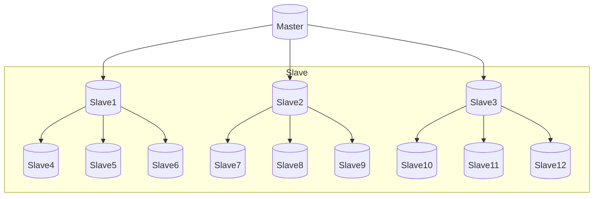
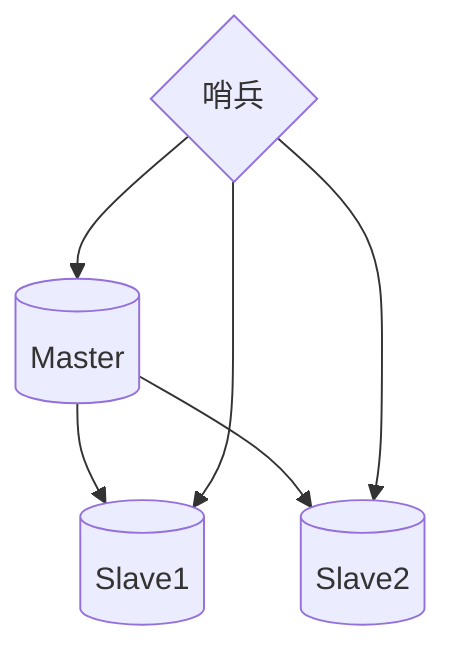
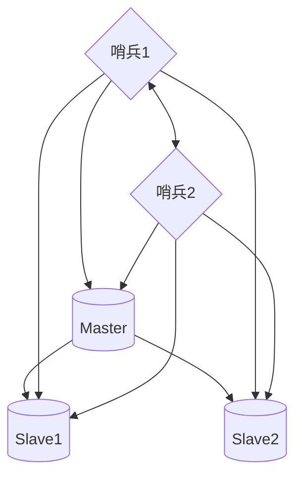
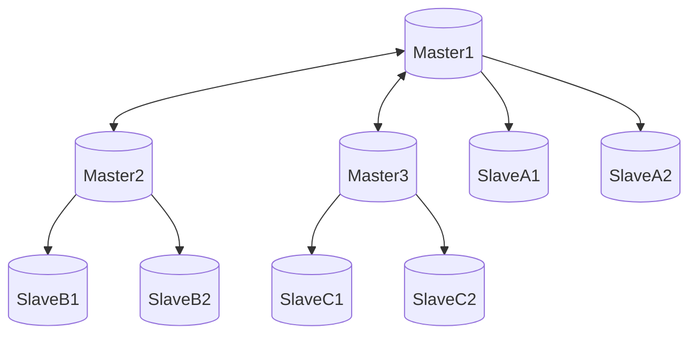
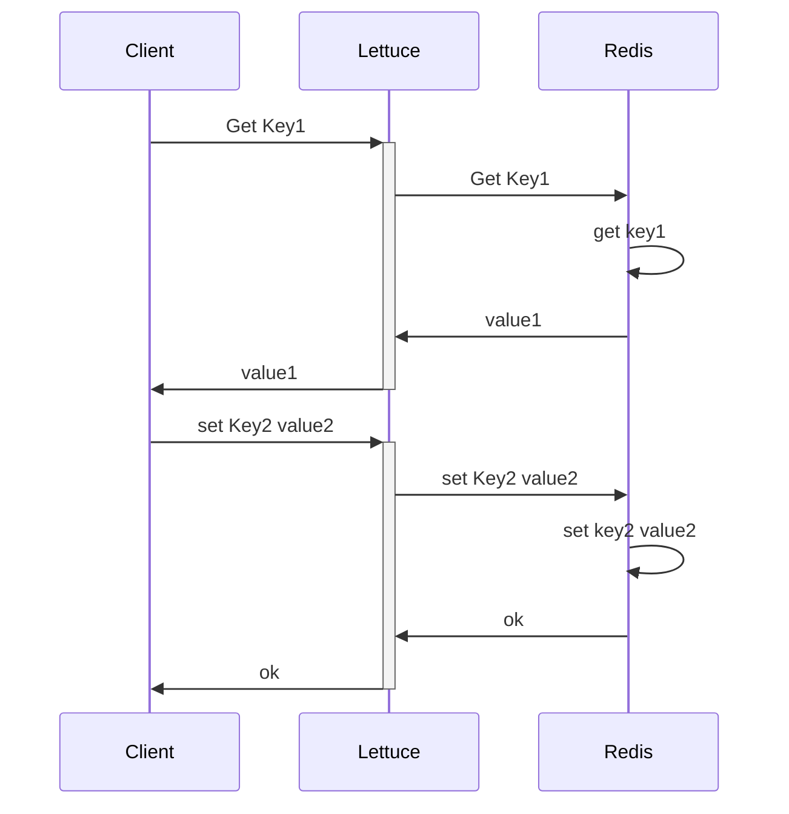
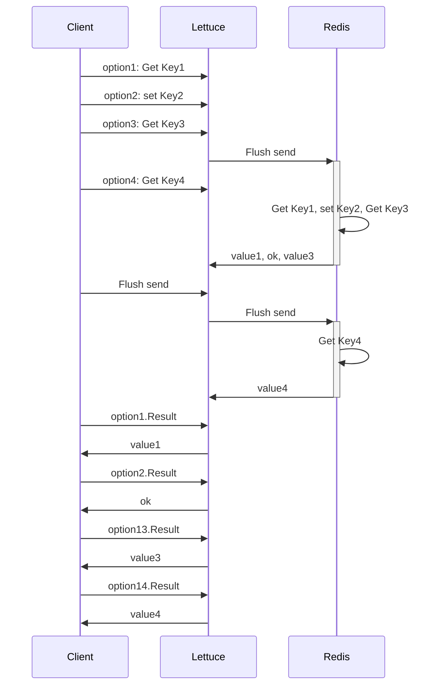
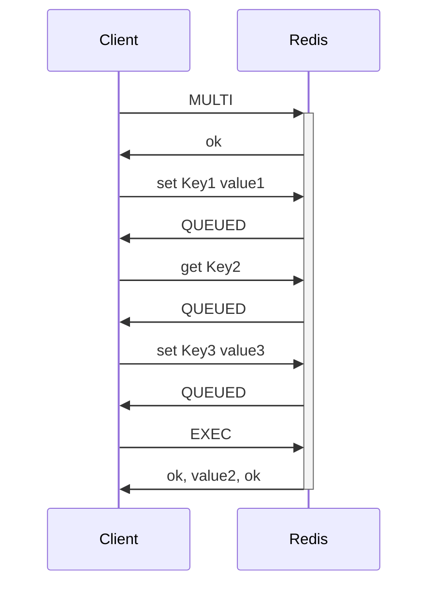

## 前言

此技术发现源于一次对`Coming`后端的Redis报错优化，在用户量激增的情况下`Coming`的后端遭受巨大的请求压力， 当然相应的对后端服务进行了扩容，在这基础上，我们仍在redis cluster集群中发现了许多的`Command timed out after 3 second(s)......`，但是Redis的集群监控显示各个分片下的每个node节点CPU和RAM压力都并不大，却一直有出现这个错误，一开始以为是连接池等问题，但是在扩大链接池的情况下仍旧有这个错误，且极易出现在`Coming`重新部署时，所以逐步判断问题应该不是出在连接池和redis本身的处理能力上(意味着盲目扩充redis cluster集群的容器也是无济于事)

## 补充

日常常见的Redis集群一般是三种模式：`主从复制模式`、`Sentinel(哨兵模式)`、`Cluster集群模式`

### 1. 主从复制模式



采用Redis的持久化功能，可以将内存中存储的Redis数据持久化存储到硬盘上，这样即使Redis重启也不会导致数据丢失，但是如果服务器硬盘数据故障，也会导致数据丢失。采用Redis的复制(replication)功能，可以将当前一个Redis节点的数据同步更新到其他节点上，这样即使一台节点宕机或者硬盘损坏导致数据丢失，也有其他从节点可以恢复数据。

在复制的概念中，数据库分为两类，一类是主数据库（master），另一类是从数据库(slave）。主数据库可以进行读写操作，当写操作导致数据变化时会自动将数据同步给从数据库。而从数据库一般是只读的，并接受主数据库同步过来的数据。一个主数据库可以拥有多个从数据库，而一个从数据库只能拥有一个主数据库。

主从复制模式可以为master节点分摊读压力，但是这个Redis不具备自动容错和恢复机制，主节点的宕机恢复需要人工介入，且会影响业务的写流程

### 2. Sentinel(哨兵)模式

单个结构：



多结构：



哨兵模式就是通过哨兵服务来监控每个Redis节点，如果Master节点挂了，就会把其中一个Slave节点切换成Master节点，并通知各方订阅切换Master节点。

哨兵从主从模式出发，增加了监控和自动切换，使得Redis集群的容灾能力更强，但是如果需要动态扩容就比较麻烦了

### 3.Cluster集群模式



这是一个Redis官方的方案，在Redis 3.0版本开始支持，是一种Redis之间的Sharding 技术。

Redis的主从实现了读写分离和数据持久化，哨兵模式则跟进一步实现高可用功能，但是上述两种模式的Redis主从之间都是存放相同数据，对内存空间造成浪费，同时难以扩展，但是Cluster模式能让Redis集群做到分布式存储。

同时集群的所有节点都是相互连通，Client可以连接任意一个节点来连接Cluster集群。

+ #### 数据分片

  Redis不采用一致性Hash，而是采用哈希槽Hash slot概念对数据进行分片存储(Coming-IM 非加密大群聊天消息也采用这种模式分片存储聊天数据)。

  Redis集群有16384个哈希槽，每个 key 通过 CRC16 校验后对 16384 取模来决定放置哪个槽。然后集群的每个节点分别负责一部分的Hash槽存取。

  这种Hash槽模式方便集群节点的添加和删除，添加或删除操作时，只需要把对应槽部分数据做迁移即可，同时不需要关闭服务，也不会影响业务的正常运行。

  集群中每个Redis节点都有Slot和cluster功能，都能计算当前key位于哪个节点的哪个插槽，且能根据结果自动跳转到对应节点进行存取。

+ #### 主从复制

  Cluster节点还具有主从特点，一个主节点对应一个或者多个从节点，当主节点宕机的时候，就会启用从节点。当其它主节点 ping 一个主节点 A 时，如果半数以上的主节点与 A 通信超时，那么认为主节点 A 宕机了。如果主节点 A 和它的从节点 A1 都宕机了，那么该集群就无法再提供服务了。

+ #### 节点互通

  - 所有的 redis 节点彼此互联(PING-PONG机制)，内部使用二进制协议优化传输速度和带宽。

  - 节点的 fail 是通过集群中超过半数的节点检测失效时才生效。
  - 客户端与 Redis 节点直连，不需要中间代理层.客户端不需要连接集群所有节点，连接集群中任何一个可用节点即可。

## 🔍寻找解决方案

开始在Google上搜寻解决方案时，看到不少人也有遇到过和我们一样的报错，看来可以站在巨人的肩膀上了,且这些报错都源自于一个Java的Redis库: `io.lettuce`，但是大部分针对这个报错的解决方法在方向都是往连接池走，甚至到最后还发现该库还被阿里云文档定为不推荐。


但是之前说到过，虽然用户量上来了，请求压力变大，但是我们扩容Redis集群后，发现集群中每个Redis节点的CPU和RAM压力都比较一般，甚至非常稳定，没有出现CPU高升，内存高涨等情况；而且上图阿里云文档的一句话也说明了这个库不差：

> Lettuce支持完整Redis API的同步和异步通信使用。

那说明这个问题的方向看错了，产生`Command timeout`问题的原因不在于Redis集群顶不住了，而是其他某一个地方顶不住了。

在浏览个大佬分析这个问题时对`lettuce`和`jedis`两个库进行过分析，探讨过为什么`lettuce`这么容易出现`Command timout`情况。

> lettuce与jedis两者有什么区别呢？
>
> lettuce：底层是用netty实现，线程安全，默认只有一个实例。
>
> jedis：可直连redis服务端，配合连接池使用，可增加物理连接。

为什么`lettuce`使用netty时默认只有一个实例，链接池不应该多建一些实例吗？

在之后的查找中，我了解到，服务器乃至后端，在面对大量用户大量请求下，每一次用户请求如何才能快速在后台服务间快速获取数据并返回，并不是靠一味的增加物理实力来粗暴的解决问题，而是有其他各种方案，比如`复用连接`，这也是`lettuce`默认只使用一个实例的原因。

## 📓解决方案

### TCP连接复用(TCP Connection Reuse)

一般搜寻这个概念，常见于前后端通信上，当面对用户大量请求时，如何做到负载均衡，负载均衡器如何快速将请求转发到对应实例上？`TCP连接复用`就是一种方案。

简单来讲，`TCP连接复用`，一般都是负载均衡器把多个用户的HTTP请求复用到一个与后端实例的TCP通信上这种技术能够大大减小服务器的性能负载，减少与服务器之间新建TCP连接所带来的延时，并最大限度的降低客户端对后端服务器的并发连接数请求，减少服务器的资源占用。


### `Lettuce`为什么默认只有一个实例

从上面可以得知，多个用户请求被负载均衡器调度到一个与后端通信的TCP管道中，减少了建立TCP建立通讯的时间。`Lettuce`采用`Netty`也是做此类事情，由于每次Redis命令操作其实就是对Redis的一次TCP请求，`Lettuce`默认只使用一个连接实例，但能把大部分的Redis命令操作复用到这一个连接上，不仅减少了实例创建带来的性能开销，还降低了通讯时间。

但是这样的方案也挡不住洪水一般的请求，当每秒Redis操作数量达到一定量时，即便通过设置增加了`Lettuce`的Redis连接池，且关闭了连接复用（`Lettuce`需要设置`shareNativeConnection`参数为`False`，才会调度连接池），但是仍会发生上一个命令还在等待结果，但是大量的命令操作已经堵在了队列里，同时已经没有空闲的连接管道用来复用发送命令。

### Redis Pipeline

> pipeline是Redis的一个提高吞吐量的机制，适用于多key读写场景，比如同时读取多个key的value，或者更新多个key的value

看原理，上图：

#### 原本Redis请求过程：



#### Pipeline:



从上图中可以明白，`Pipeline`模式就是一种缓冲并打包📦模式。打个比方，这个过程就好像送快递，第一个过程，就是一个快递发一趟车🚗，另一个再发一趟，并且回来时运回来了对方给你的快件。但是Pipeline就像一辆集装箱，他会等待你的一堆无相关性的命令，等到车装满后（缓冲区满了）就自动发车，并回来时带回来对方的回件，如果车没满，但是收到Client的flush命令（我们暂时没快递了，发车吧）也会发车并带回对方回复。并且这些回复会缓存在快递站，等待着Client自己去拿

```java
public Object executeBinary(final List<List<byte[]>> keysList, final List<List<byte[]>> argsList) {
    List<RedisFuture<Object>> futureList = redisCluster.withBinaryCluster(connection -> {
      try {
        final RedisAdvancedClusterAsyncCommands<byte[], byte[]> binaryCommands = connection.async();
        List<RedisFuture<Object>> futures = new ArrayList<>();

        if (keysList.size() == argsList.size()) {
          //循环发送命令
          for (int i = 0; i < keysList.size(); i++) {
            RedisFuture<Object> future;
            try {
              future = binaryCommands
                  .evalsha(sha, scriptOutputType, keysList.get(i).toArray(BYTE_ARRAY_ARRAY),
                      argsList.get(i).toArray(BYTE_ARRAY_ARRAY));
            } catch (final RedisNoScriptException e) {
              reloadScript();
              future = binaryCommands
                  .evalsha(sha, scriptOutputType, keysList.get(i).toArray(BYTE_ARRAY_ARRAY),
                      argsList.get(i).toArray(BYTE_ARRAY_ARRAY));
            }
            futures.add(future);
          }
          //flush 刷新缓冲区
          binaryCommands.flushCommands();
        }
        return futures;
      } catch (final Exception e) {
        log.warn("Failed to execute script", e);
        throw e;
      }
    });
		//获取结果
    List<Object> executeResult = new ArrayList<>();
    for (RedisFuture<Object> future : futureList) {
      try {
        executeResult.add(future.get());
      } catch (final Exception exception) {
        log.warn("Failed to get script result", exception);
      }
    }
    return executeResult;
  }
```

```go
// ExpireMapping expire a mapping.
func (r *Client) ExpireMapping(c context.Context, mid int64, key string) (has bool, err error) {
	var (
		pipeCmder  []*redis.BoolCmd
	)
	//创建Pipeline
	pipe := r.redis.Pipeline()
	if mid > 0 {
    //循环发送命令
		pipeCmder = append(pipeCmder, pipe.Expire(c, keyMidServer(mid), time.Duration(r.redisExpire) * time.Second))
	}
	pipeCmder = append(pipeCmder, pipe.Expire(c, keyKeyServer(key), time.Duration(r.redisExpire) * time.Second))

	if _, err = pipe.Exec(c); err != nil {
		log.Errorf("pipe Exec (%d,%s) error(%v)", mid, key, err)
		return
	}
  //循环获取结果
	for _, v := range pipeCmder {
		if has, err = v.Result(); err != nil {
			log.Errorf("pipeline.Result() error(%v)", err)
			return
		}
	}
	return
}
```

**Pipeline局限在于会一旦开启会占用一个连接实例，在操作结束前，不会释放**

## ➕补充

### Redis Lua

Redis可以执行Lua脚本，但是当Lua脚本过大时，每次命令的发送也是一次很大的数据量，这会影响网络的请求时间和性能。

Redis可以采用先写好Lua脚本，在启动项目时，先把这些脚本注册到Redis中，并获得该脚本的唯一标签，之后可通过该标签+填入参数的方式发送给redis，Redis就能匹配执行预先缓存的Lua脚本，并返回数据。

### Redis 事务

Redis事务比较容易与Pipeline混淆。



事务的`DISCARD`取消需要在EXEC之前执行

容易混淆的是Redis事务也是类似命令缓冲的过程，但是如果不加上`Pipeline`，事务的每一条命令都是直接送达`Redis`，由`Redis`缓存，并且一旦执行`DISCARD`，之前的执行操作就会失效，但是该事务非原子性，其中一条操作的失败不会影响其他的操作

> *It's important to note that even when a command fails, all the other commands in the queue are processed – Redis will not stop the processing of commands.*
